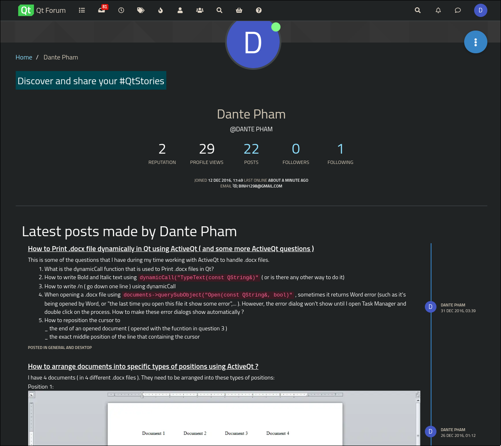
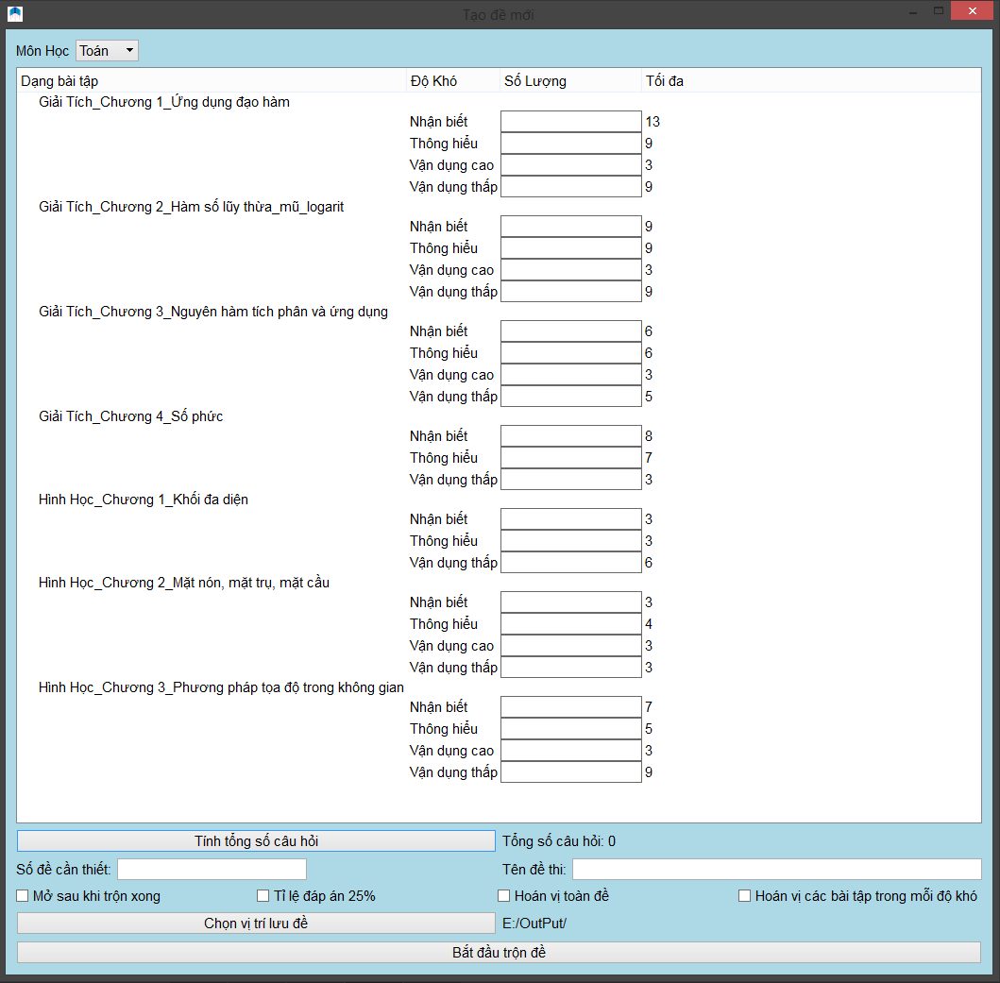
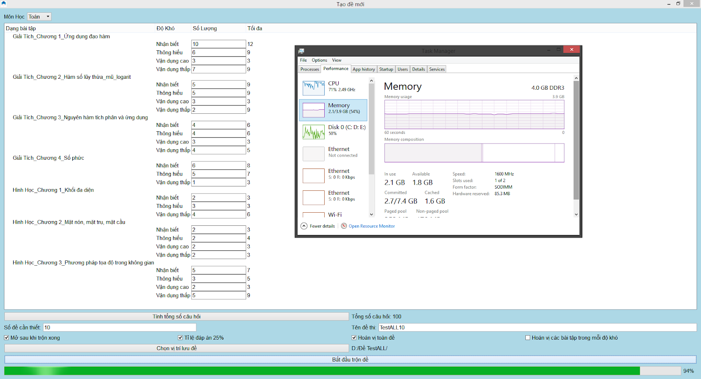
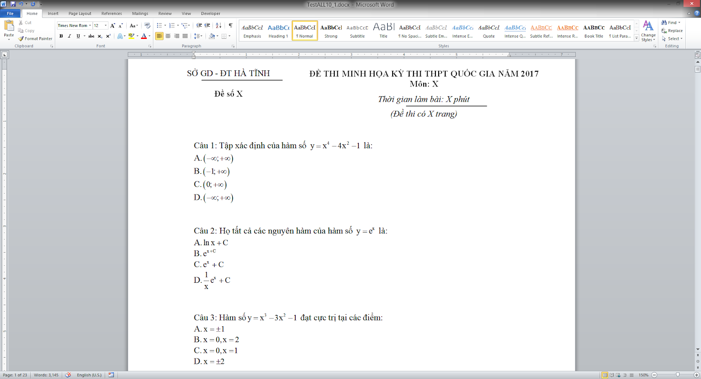
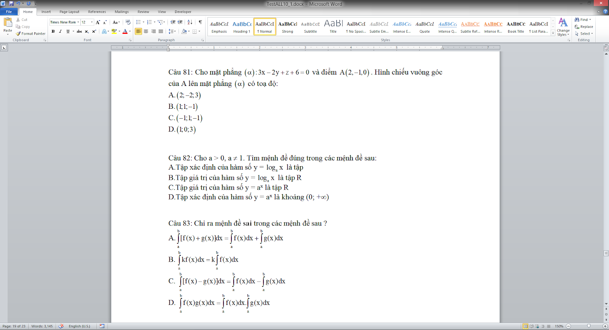
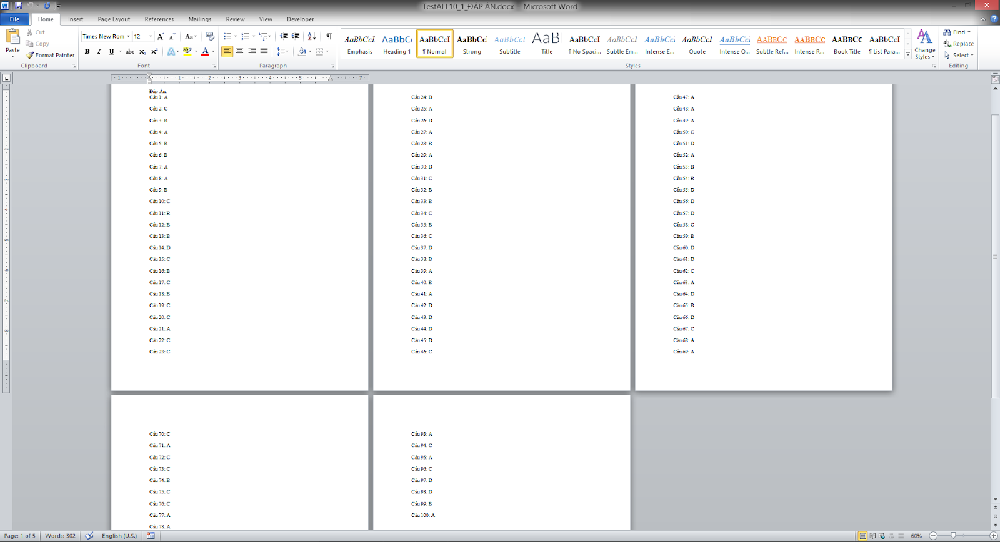
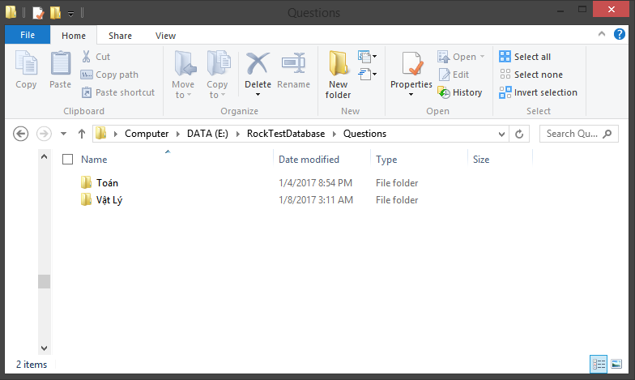
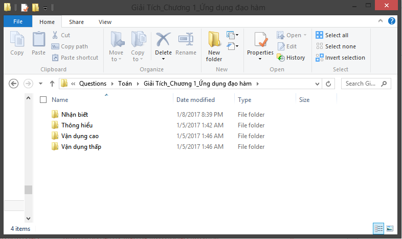
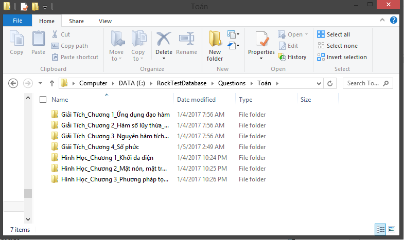
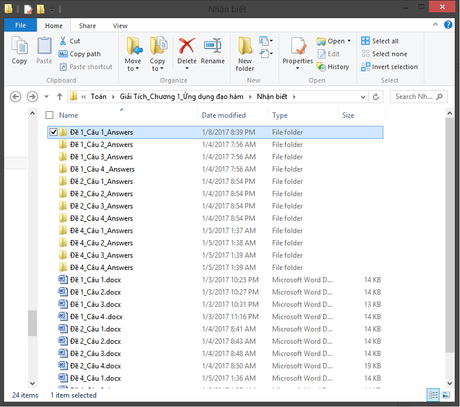

# High-School-Project 1: Rocktest.

This is a software that is used to **create multiple-choice exercises and tests** for Vietnamese teachers, especially those my high school. At the time, they were using McMix, a software that, in my opinion, has a terrible UI/UX. 

Written in Qt 4.1(Community version) using C++

**This got me 2nd prize in my province's science fair in late 2016**

To develop this, I had to make quite a few questions on the Qt Forums =))

# Demo: Generate the tests

# Output: 

# At the time, I didn't know how to use a relational database, so I just use the file system as my database

